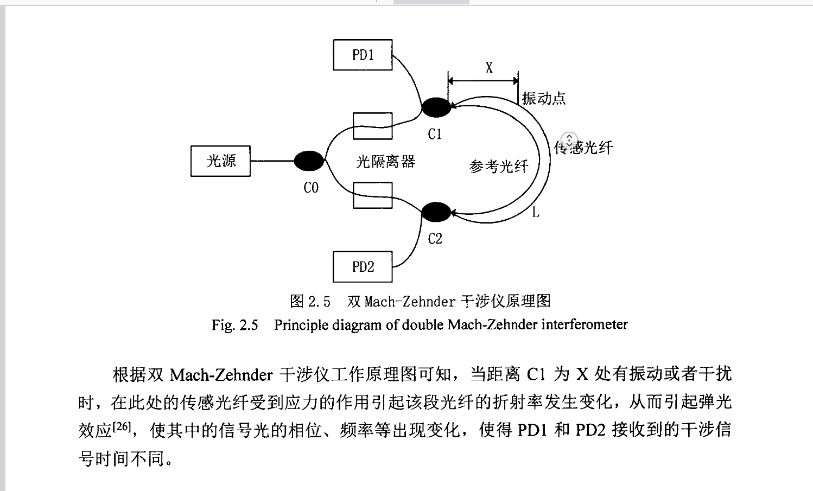

一切资源均是网络获取 本仓库只是起到归档作用

# 光纤传感器

[https://kns.cnki.net/kcms2/article/abstract?v=LGlPPz-4LgErqhMY49Vv5_Jv7QLsVVj-0Lp71w3gFmUgICLkv0kCqvrYEas_qFJHRlYEvBWn72qXYNAg7xOTSheHrptTP833UDBV5wjXOxvrxh0EWTdW01r9tV-VLdDDRafO5ICsup1ipAZJNnqYQg==&amp;uniplatform=NZKPT&amp;language=CHS](https://kns.cnki.net/kcms2/article/abstract?v=LGlPPz-4LgErqhMY49Vv5_Jv7QLsVVj-0Lp71w3gFmUgICLkv0kCqvrYEas_qFJHRlYEvBWn72qXYNAg7xOTSheHrptTP833UDBV5wjXOxvrxh0EWTdW01r9tV-VLdDDRafO5ICsup1ipAZJNnqYQg==&uniplatform=NZKPT&language=CHS)

## 分布式光纤振动信号的识别与定位算法研究


分 布 式 光 纤 振 动 信 号 的 识 别 与 定 位 算 法 研 宄 
外 界 非 正 常 信 号 作 用 于 光 缆 时 ， 就 会 将 干 扰 信 号 传 输 进 入 到 全 光 纤 干 涉 系 统 。 光 纤 干 涉
系 统 由 反 射 镜 和 光 缆 组 成 ， 光 源 发 出 的 相 干 光 传 输 进入 光 纤 干 涉 系 统 ， 并 经 过 反 射 端 将
相 干 光 经 反 射 发 送 至 光 缆 ， 然 后 传 输 到 全 光 纤 干 涉 系 统 。 由 于 两 个 光 来 自 不 同 的 方 向 ，
所 以 汇 合 在 一
起 后 会 有 干 涉 现 象 发 生 ， 即 光 波 间 的 相 位 发 生 变 化 ， 称 其 为 相 位 差 的 变 化 。
光 波 再 通 过 信 号 处 理 模 块 对 接 受 到 的 干 扰 信 号 进 行 处 理 与 分 析 ， 并 基 于 互 相 关 算 法对 系
统 的 时 延 差 进 行 计 算 。 最 后 就 可 以 准 确 的 对 外 界 信 号 进 行 定 位 ， 实 现 连 续 分 布 式 光 纤 传
感 定 位 系 统 的 预 警 功 能 。
光 源 ——
？！
  全 光纤 干 广 ￣
．
ｉ  
１ ．
，  ＇
涉 纖  ？ 反 射 端
信
１ Ｓ
理 ＾ —
接 收模 块
：
Ｉ
图 ２ ．  ４ 定 位 系 统 结 构 框 图
Ｆ ｉ
ｇ ．  ２ ． ４  Ｓ ｔ ｒ ｕ ｃ ｔ ｕｒａｌ  ｂ ｌ ｏ ｃ ｋ  ｄ ｉ ａｇ ｒ ａ ｍ  ｏ ｆ  ｐ ｏ ｓ ｉ ｔ ｉ ｏ ｎ ｉ ｎ ｇ  ｓ ｙ ｓ ｔ ｅ ｍ
２ ．  ３ 基 于 双 Ｍ ａ ｃ ｈ －
Ｚ ｅ ｈ ｎ ｄ ｅ ｒ 光 纤 干 涉 仪 传 感 与 定 位 原 理
根 据 上 节 中 提 到 的 Ｍ ａ ｃ ｈ －
Ｚ ｅ ｈ ｎ ｄ ｅ ｒ 干 涉 型 传 感 结 构 ， 本 节 将 继 续 从 Ｍ ａ ｃ ｈ －
Ｚ ｅ ｈ ｎ ｄ ｅ ｉ
？
光
纤 传 感 的 原 理 以 及 双 Ｍ ａ ｃ ｈ －
Ｚ ｅ ｈｎｄ ｅ ｒ 光 纤 干 涉 仪 传 感 的 定 位 原 理 来 进 行 研 宄 。
２ ．  ３ ．  １  Ｍ ａ ｃ ｈ －
Ｚ ｅ ｈ ｎ ｄ ｅ ｒ 干 涉 型 光 纤 传 感 器 原 理
Ｍ ａ ｃ ｈ －
Ｚ ｅ ｈ ｎ ｄ ｅ ｒ 型 光 纤 千 涉 仪 的 传 感 原 理 是 当 系 统 接 收 到 振 动 信 号 时 ， 会 引 起 干 涉 仪
中 的 光 在 光 纤 中 的 传 播 ， 使 光 在 传 播 过 程 中 的 相 位 发 生 变 化 ， 而 同 频 率 的 相 干 光 当 相 位
改 变 时 会 发 生 干 涉 现 象 产 生 干 涉 条 纹 。 光 纤 传 感 器 就 是 利 用 这 一
特 点 得 到 干 涉 条 纹 的 光
强 变 化 的 ， 进 而 可 以 获 取 振 动 信 号 的 波 形 ［ ２ ５ ］
。 但 是 光 纤 干 涉 仪 也 存 在 一
定 缺 陷 ， 其 相 干
光 在 空 气 中 进 行 传 播 时 会 受 到 温 度 、 以 及 环 境 中 的 噪 声 干 扰 以 及 空 气 折 射 率 变 化 的 影 响 ，
最 终 引 起 千 涉 仪 在 空 气 中 传 输 光 程 的 变 化 ， 导 致 了 多 种 问 题 的 出 现 ， 如 干 涉 测 量 的 精 度
变 低 、 干 涉 仪 处 于 不 稳 定 的 工 作 状 态 等 。 针 对 以 上 干 涉 仪 出 现 的 问 题 与 缺 陷 现 将 单模 光
纤 技 术 应 用 到 光 纤 干 涉 仪 的 内 部 组 成 光 路 中 ， 这 样 既 可 以 提 高 系 统 的 定 位 精 度 使 之 满 足
加 长光缆 的 系 统 定 位 需 求 ， 又 能 消 除 空 气 的 温 度 和 湿 度 对 相 干 光 传 播 过 程 中 光 程 变 化 的
影 响 。 光 纤 干 涉 仪 获 取 干 扰 信 号 的 过 程 是 ： 首 先 干 涉 仪 内 的 光 纤 传 感 器 采 集 到 被 测 物 理
量 变 化 的 信 号 ， 然 后 经 光 纤 进 行 相 位 调 制 使 光 纤 中 传 播 的 光 信 号 的 相 位 也 随 着 发 生 调 制 ，
－
８ －

大 连 海 事 大 学 专 业 学 位 硕 士 学 位 论 文 
之 后 因 相 位 的 变 化 使 相 干 光 发 生 千 涉 现 象 产 生 干 涉 条 纹 ， 最 后 利 用 相 干 光 的 干 涉 原 理 ，
即 干 涉 条 纹 光 强 的 变 化 与 信 号 的 关 系 ， 将 环 境 中 可 能 出 现 的 干 扰 信 号 的 波 形 解 调 出 来 。
由 图 ２ ． ３ 可 以 清 楚 地 看 出 Ｍ ａ ｃ ｈ －
Ｚ ｅ ｈ ｎ ｄ ｅ ｒ 干 涉 仪 的 具 体 组 成 结 构 是 由 两 个 完 全 相 同
的 信 号 光 纤 和 参 考 光 纤 组 成 。 千 涉 仪 中 的 激 光 器 发 射 一
束 相 千 光 进 入 单 模 光 纤 ， 其 中 该
相 干 光 为 连 续 信 号 而 不 是 间 断 激 光 脉 冲 信 号 ， 并 且 要 使 激 光 器 发射 的 光 束 能 产 生 明 显 的
干 涉 现 象 ， 其 需 要 满 足 一
定 的 约 束 条 件 ， 如 发 射 光 的 振 动 频 率 相 同 且 存 在 相 互 平 行 的 振
荡 分 量 以 及 相 位 差 恒 定 。 因 为 相 干 光 的 产 生 需 要 满 足 必 要 的 条 件 ， 所 以 要 想 产 生 相 干 光
对 光 源 就 有 一
定 的 要 求 ， 不 能 选 择 两 个 相 互独 立 的 光 源 来 产 生 相 干 光 。 两 个独 立 的 光 源
所 产 生 的 光 是 不 相 干 的 ， 因 为 它 们 的 振 动 频 率 、 振 动 方 向 以 及 初 始 相 位 等 都 随 时 间 在 不
断 变 化 着 ， 不 能 满 足 相 干 光 的 约 束 条 件 ［
２ ６ ］
。 因 此 ， 选 择 的 光 源 要 是 同 频 率 的 ， 最 有 效 的
方 法 是 选 取 同 一
辐 射 中 心 产 生 的 两 列 光 波 ， 即 同 一
原 子 所 发 出 的 光 波 分 解 成 两 列 或 几 列
作 为 相 干 光 ， 这 时 只 要 彼 此 之 间 经 过 的 光 程 不 同 即 会 产 生 干 涉 现 象 。 图 ２ ． ３ 中 就 是 采 用
此 种 方 式 得 到 的 相 干 光 ， 即 将 一
束 光 经 大 小 为 ３ ｄ Ｂ 的 耦 合 器 后 分 成 两 束 光 强 相 同 的 光 ，
然 后 将 它 们 分 别 传 入 传 感 光 纤 和 参 考 光 纤 中 。 传 感 光 纤 的 光 由 于 会 受 到 外 界 信 号 的 干 扰 ，
即 调 制 作 用 ， 成 为 携 带 外 界 干 扰 信 号 的 信 号 光 ， 而 另 一
路 等 光 强 的 光 束 不 进 行 处 理 作 为
参 考 光 进 行 传 播 ， 然 后 两 束 光 经 传 感 臂 和 参 考 臂 在 耦 合 器 ２ 处 相 遇 发 生 干 涉 现 象 ， 最 后
由 光 电 监 测 装 置 将 发 生 干 涉 后 的 光 信 号 转 变 成 电 信 号 ， 并 经 计 算 机 接 收 后 进 行 信 号 处 理 。
参 考 臂 光 纤 Ｍ ａ ｃ ｈ －
Ｚ ｅ ｈ ｎ ｄ ｅ ｒ 干 涉 仪对 外 界 被 测 物 理 量 的 变 化 非 常 敏 感 ， 其 接 收 端 的 光 纤
探 测 器 能 够 探 测 到 光 纤 上 细 微 的 传 导 光 波 的 相 位 改 变 ， 并 将 探 测 到 的 信 息 向 后 传 递 。 公
式 （ ２ ． ３ ） 给 出 了 光 纤 中 光 传 播 过 程 其 相 位 变 化 的 一
般 表 达 式 ：
＜
ｆ
＞  ＝  ｎ ｋＬ  （ ２ ．  ３ ）
其 中 ， 《 是 光 纤 内 部 介 质 的 折 射 率 ； ／ ｔ 是 真 空 中 的 光 波 数 ； Ｚ 是 整 个 光 纤 长 度 ；
表 示 光 路 的 总 长 度 。 若 忽 略 光 偏 振 的 影 响 ， 对 式 （ ２ ． ３ ） 两 边 进 行 微 分 运 算 可 以 得 到 ：
ｄ
ｌ ＝ 
ｄｋ
 ＋
ｄＬ
 ＋ 
ｄｎ
 （ ２ ． ４ ）
（
／
＞  ｋ  ｋ  ｎ
式 （ ２ ． ４ ） 中 ， 第 一
项 中 光 波 数 的 变 化 受 到 光 源 特 性 的 影 响 ， 如 波 长 、 频 率 等 的 影 响 。
第 二 、 三 项 描 述 的 是 光 纤 长 度 变 化 和 折 射 率 变 化 对 相 位 的 影 响 ， 即 光 纤 物 理 特 性 的 变 化
对 相 位 变 化 的 影 响 ， 如 湿 度 、 气 压 、 温 度 等 都 是 通 过 影 响 光 纤 的 物 理 特 性 来 改 变 相 位 的 。
光 经 过 ３ ｄ Ｂ 耦 合 器 的 作 用 实 现 了 分 路 ， 但 要 使 光 在 光 纤 间 相 互 传 递 需 满 足 一
定 的 条
件 ， 即 相 互 传 递 的 两 条 光 纤 纤 芯 距 离 要 尽 可 能 的 近 。 经 ３ ｄ Ｂ 耦 合 器 后 ， 得 到 光 强 在 参 考
臂 和 信 号 臂 上 的 变 化 分 别 为

丹麦Ibsen提供的I-MON 512 OEM
型体光栅解调模块，单通道测量频率最大可达34KHz。可实现高精度、高重复性测量，性能稳定。该模块可应用于温度、应变、振动（高速选项）、加速度等物理量的实时监测与分析。该模块加上模拟放大电路、A/D转换电路及数字信号处理，就可构成光谱分析仪或者光纤光栅解调仪。

**指标规格：**

| 波长范围     | 1510~1595nm |
| ------------ | ----------- |
| 测量速率     | 17kHz(max)  |
| 重复性       | 3~5pm       |
| 分辨率       | ＜0.5pm     |
| 动态范围     | 30dB        |
| 可监测光功率 | -80~-20dBm  |
| 光学接口     | FC/APC      |
| 数据接口     | 针脚        |
| 工作温度     | 0~70℃      |
| 尺寸         | 21x50x66mm  |
| 波长范围     | 1525~1570nm |
| 测量速率     | 35kHz(max)  |
| 重复性       | 3~5pm       |
| 分辨率       | ＜0.5pm     |
| 动态范围     | 30dB        |
| 可监测光功率 | -80~-20dBm  |
| 光学接口     | FC/APC      |
| 数据接口     | 针脚        |
| 工作温度     | 0~70℃      |
| 尺寸         | 23x58x71mm  |

## 讨论

FBG 光纤布拉格光栅  收到应力作用  光栅周期   波长的迁移

DNS分布式  瑞丽散射性  起到滤波器的作用

单模多模

MMI  交叉敏感问题  不能保证控制变量法的施行

改进型光纤压力传感器

溶液浓度   马克斯    模式变化 单模 分光溶解点   合光溶解点

不利菠萝气压传感器    微泡  检查压力
