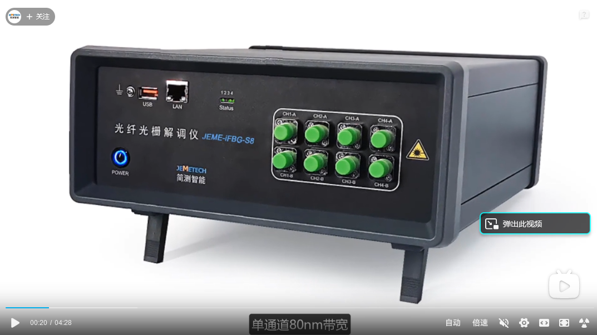
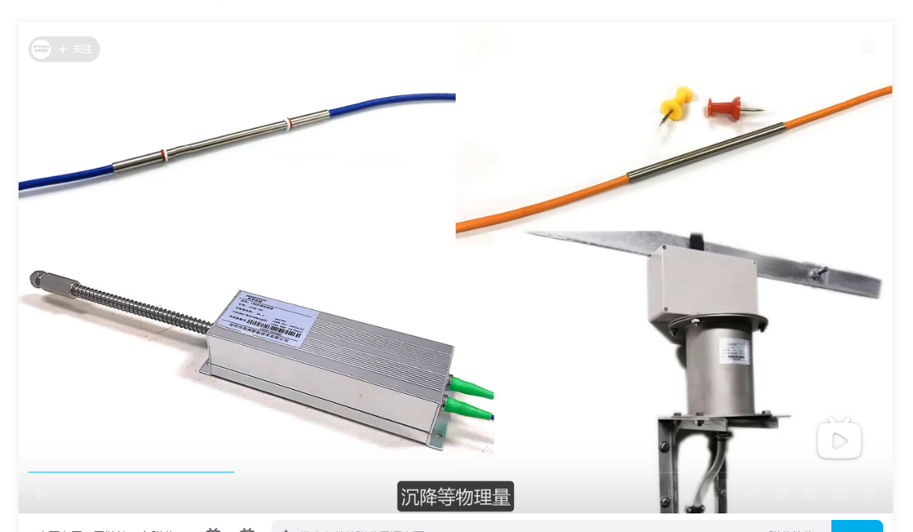
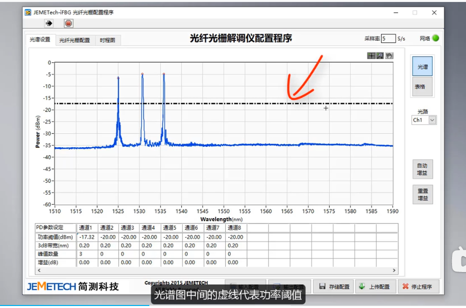
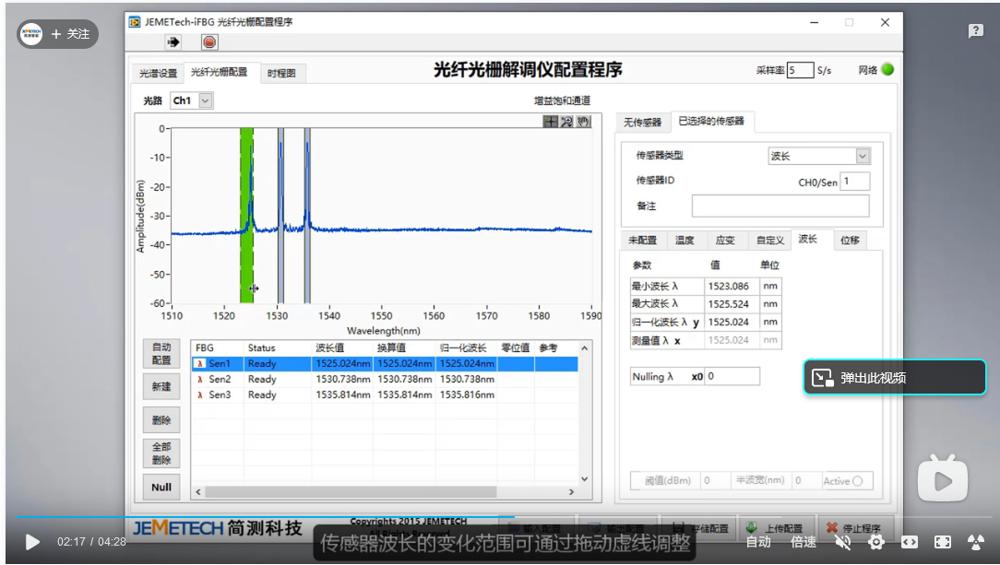
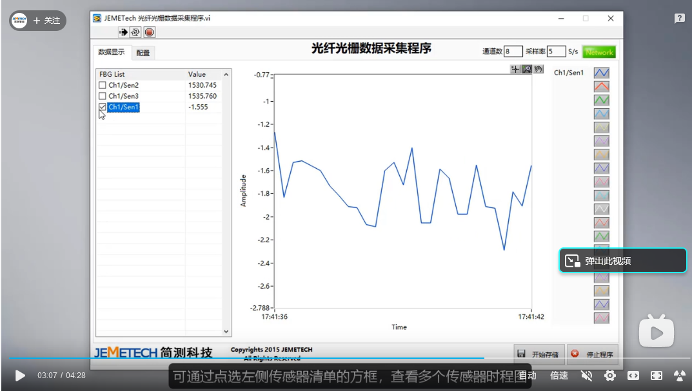

## 背景

文章是2024年2月的   作者说没人研究光纤测流量，他们就去做了

## 原理

卡门涡街现 象 是 一 种 典 型 的 流 致 振 动 现 象[1],
最初研究涡街现象的目的是为了防灾

光 纤 布 喇 格 光 栅 (FBG)   灵敏度高,体积小和抗电磁干扰强

大 多 数 为 靶 式[6]、压 差式[7]、涡轮式[8]和热式[9]等方法

hoichiTakashima等[10]介 绍 了 一种双光纤光栅的互相关流量计

李 红 民等[11]设计了一 种 不 受 温 度 影 响 的 光 纤 光 栅 涡 街 流  PIN 光电 探 测 器 接 受 涡 街 流 量传感器的光信号,并 利 用 带 通 滤 波 器 消 除 低 频 波 动以解 决 光 纤 光 栅 温 度 交 叉 敏 感 问 题

### 本实验

FBG 涡街流 量 传 感 器 目 前 仍 处 在 更 深 层 次 研
究中,为了将光纤传感与涡街流量计相结合,本文设
计了一种基于 FBG 的 涡 街 流 量 传 感 器。该 传 感 器
通过弹簧钢片作为 悬 臂 梁,将 涡 街 信 号 转 化 为 悬 臂
梁振动,同时 作 用 于 FBG,当 不 同 流 量 经 过 传 感 器
时,FBG 中心波 长 移 位 频 率 不 同,进 而 测 量 出 涡 街
频率,通过涡街频率的大小反映了液体流量大小。

### 我们做

FBG 传感原理    可以直接抄

第一个实验  验证FBG 的 中 心 波 长 与 温 度 之间的拟合关系式

第二个实验   流量传感实验

XL-1 油气水 三 项 流 模拟装置    （买不到）

涡街流量计   （比不过电磁吧）

MOI-OSSM-ATX-1 光纤光栅动态解调仪

PS-305数控式线性直流稳压电源(可提供±DC30 V

[https://www.bilibili.com/video/BV19c411h7G7/?spm_id_from=333.337.search-card.all.click&amp;vd_source=755a8a892b8937188d55d8c67a74f76c](https://www.bilibili.com/video/BV19c411h7G7/?spm_id_from=333.337.search-card.all.click&vd_source=755a8a892b8937188d55d8c67a74f76c)

形变  温度   距离  沉降

采样率   5s/s

 可我自己最常用的单位是 Hz。 那 S/s、S/s/通道、Hz 这三个单位间是什么关系呢？为啥 NI 会使用 S/s、S/s/通道这样的单位？

S/s 是 samples per second 的意思，就是每秒能采几个点。  **大家会发现S/s和Hz其实是一个意思** （有点不严谨，Hz能表达的意思更多）。

这时候一些老鸟就会提到一个概念，模数转换器 ADC！ 这是干嘛的呢，通俗来讲，就是用来采集模拟量信号，然后将这个模拟量信号转换成数字量信号（01010101……）后，这样设备就能知道我们的采集到的电压是多少啦。

但因为ADC的速率很高，有时候我们会用一个ADC去采集多个通道。这时候怎么去计算各个通道的采样速率呢？参考下文：

> 例如，对于USB-6009,总采样速率为48kS/s。
> 一个通道的最大采样率为：48kS/s
> 两个通道的最大采样率为：Fs / 2 = 24kS/s
> N个通道的最大采样率为：Fs / N = 48/N kS/s

注意由于是一个adc轮询多个通道进行采集，所以多个通道的采集结果会在时间上有一定的误差，当然由于采集速度很快，在一些要求不是特别严格的情况下，其实可以无视这些微小的时间误差。

那什么是最舒服的解决方案呢？就是我每个通道都给他配个ADC再想办法把它同步起来。也就是S/s/通道。

> 机智的小伙伴便会发现，如果转换成的数字量信号它的位数越多，是不是就越“精细”？对的，这就是采集板卡的另一个属性点—— **分辨率** ！
> 这边我不去细说，假设一个数采板卡的分辨率是 14bit，它能采集的电压范围是 0-5V。那么它能采到的最小步长的电压就是 5/(2^14) = 0.0003051 V，也就是 0.3051 mv。

其实这样看来，使用S/s 和 S/s/通道，这两个单位，可以避免很多理解上的歧义，还是比较不错的。

示波器

1GS/s指的是采样率，前面大写的S是sample采样的意思

后面的s是秒 也就是示波器一秒采1G个点G是10的9次方，也就是一秒采1亿个点
